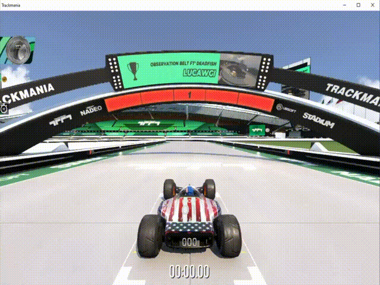

# Real-Time Autonomous RL Racing in TrackMania

A reinforcement learning project exploring autonomous racing agents in TrackMania using the TMRL framework. The goal was to compare modern RL algorithms under real-time simulator constraints, where agents must learn driving behavior from high-dimensional visual observations.

## Demo

## Overview

This project investigates how different reinforcement learning methods perform in a visually rich, real-time racing environment. We experimented with on-policy and off-policy RL approaches and compared them across:

- Training stability
- Sample efficiency
- Final driving performance
- Sensitivity to reward design and runtime constraints

## Environment

- Simulator: TrackMania
- Framework: TMRL

## Algorithms Explored

### PPO: Proximal Policy Optimization

PPO was used as a simple on-policy baseline. It uses clipped policy updates to improve training stability while avoiding overly large policy changes.

### SAC: Soft Actor-Critic

SAC was used as an off-policy maximum-entropy actor-critic method. We explored multiple SAC variants, including:

- SAC without gradient clipping
- SAC with gradient clipping and smaller encoder dimension
- SAC with longer warm-up and hyperparameter tuning

### REDQ: Randomized Ensembled Double Q-Learning

REDQ extends SAC with an ensemble of Q-functions and a high update-to-data ratio. The goal is to improve sample efficiency while reducing overestimation bias.

### DroQ: Dropout Q-Functions

DroQ was explored as a lower-cost alternative to REDQ. It uses high update-to-data ratios with dropout critics to improve data efficiency without requiring a large critic ensemble.

## Reward Design

The reward function was designed around core driving behavior:

- Track progress reward
- Crash penalty
- Survival bonus

This encouraged the agent to move forward, avoid crashes, and remain active in the environment.

## Results Snapshot

The experiments compared PPO, SAC variants, and REDQ configurations under real-time TrackMania constraints.

The experiments were exploratory and limited by available GPU resources and real-time simulator runtime.
